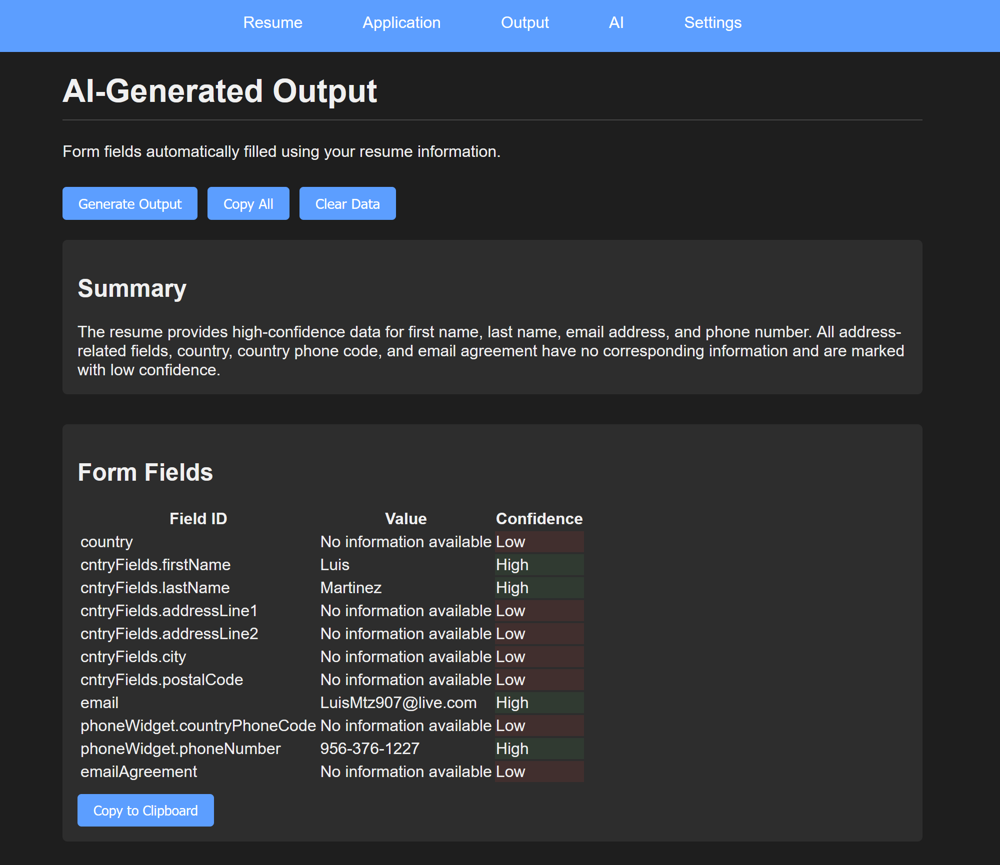

The Applytron project started as a series of small utility devices and evolved into a framework for rapid prototyping with a human-centered lens.

We combined off-the-shelf modules with custom PCBs to quickly validate concepts—from sensor-driven helpers to wearables and interactive objects.

[video: videos/brunitosquirt.mp4 | Early demo assembly line | controls=true | muted=true | autoplay=false | loop=false]

# What Worked

- Fast iteration with dev boards and breadboards
- Clear documentation and quick video captures
- Keeping UX front-and-center during demos
