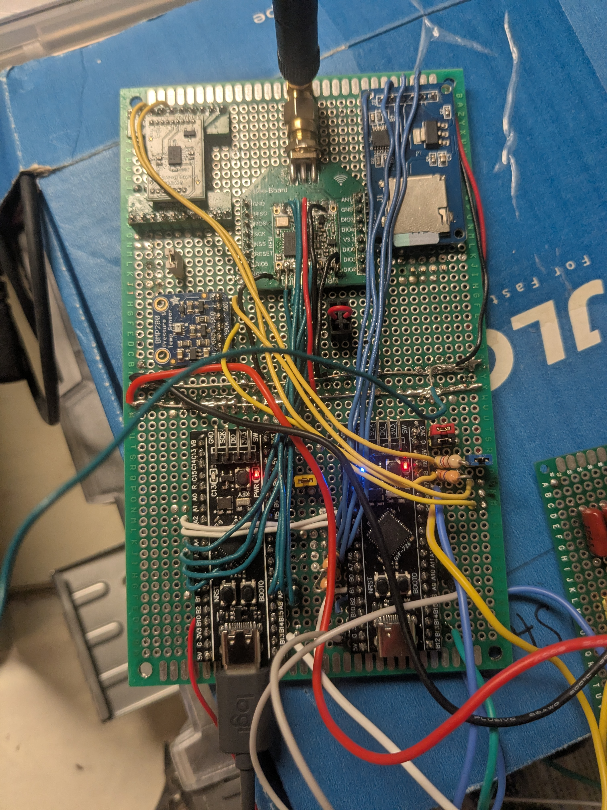

In early 2024, our avionics team had to make fast, decisive moves. Supply issues and tight deadlines pushed us to design and build a backup flight computer we called Brunito.

Building on Bruno's foundations, we focused on simplicity and reliability. We reduced payload, hardened power rails, and tightened the real-time loops—enough to handle critical telemetry and event logging during test flights.

[video: videos/brunitosquirt.mp4 | Final systems check: power-on self-test with actuator pulses | controls=true | muted=true | autoplay=false | loop=false]

# Lessons Learned

- Mitigate EMI early by isolating switching regulators
- Keep ISR work minimal; defer to tasks
- Always log more than you think you need
