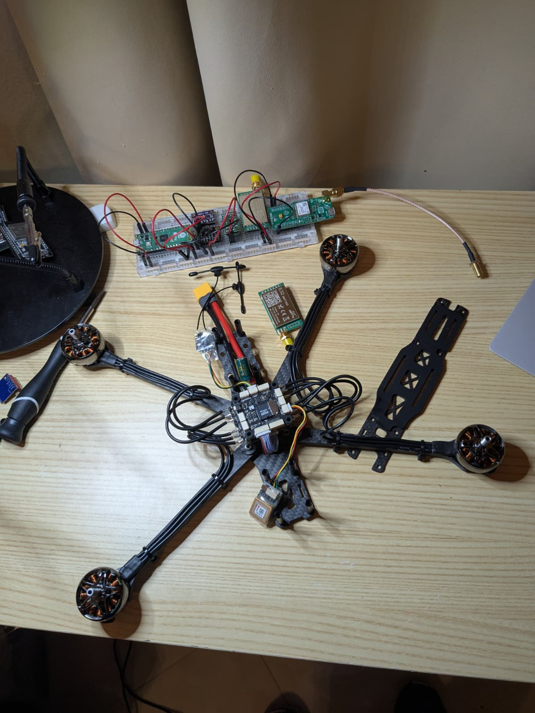
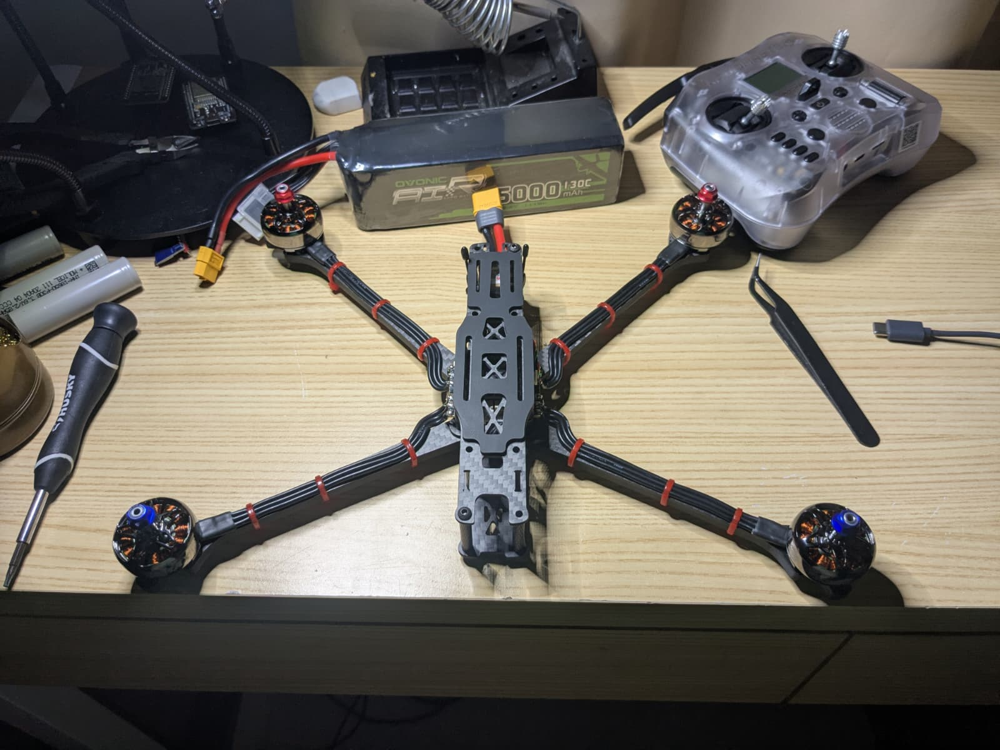
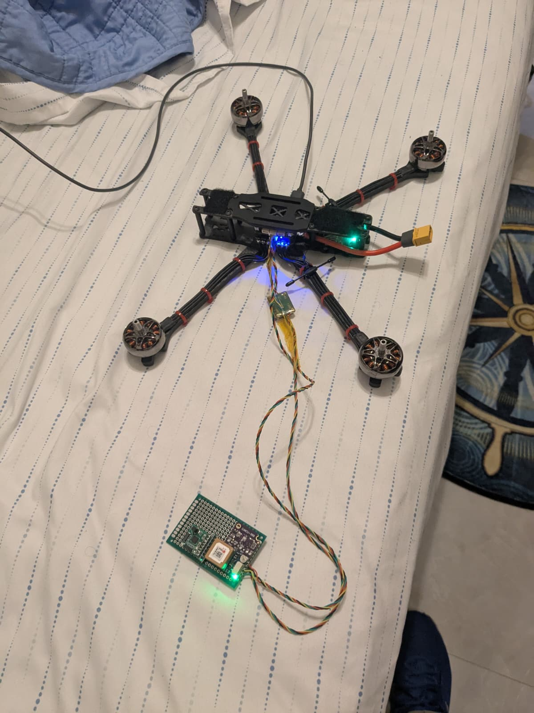
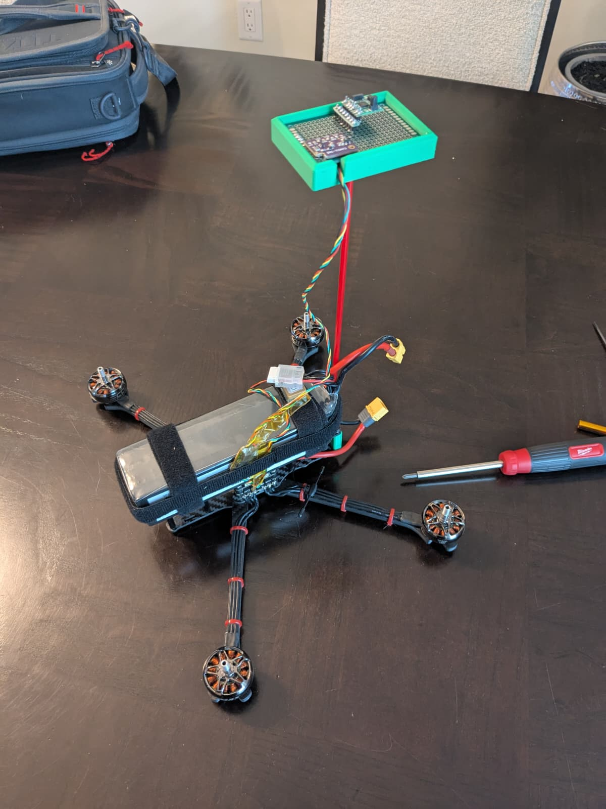

Hello! I've only really been going over things I'm doing at a very high level and I'm hoping this is the turning point to that! In this post I will be covering the drone build that I made just in case anyone would like to replicate it or would like to understand the process behind my choice of parts. 

During the summer I made it a point to try and get all the sensors working and I was successful in that, but I left out the entire process in my previous post. 

The beginning of it all was when I decided I wanted to have a deeper understanding of how it was that flight controllers operated. I scoured reddit and forums dedicated to flight controllers, but I was still lacking the intuitive-ness of it all. This was when I decided I would build my own drone from pre-existing parts. 

I did some researching and used AI to help put together a list of parts for my new 7 inch drone. Firstly, I identified what my objective for this drone would be, and it was mostly going to be used for long range and hauling things into the sky for testing, so I chose motors that were capable of such a task. Secondly, I chose a flight stack that was capable of powering these motors at their full potential. The rest of the components like the GPS were chosen based on preference. I'm used to Ublox GPS' since it's all I've used when prototyping, so I went for a ublox GPS. 

If there were some things I wish I would have paid more attention to before buying it would be my frame and my flight controller itself. Not to say that either were bad, but the MicoAir743v2 is way overkill for what I needed, and the magnetometer onboard was basically useless (I will explain why later), and the source one v5 is very small. I should have gotten a frame that was larger so that I could fit more components in it, and maybe also a less fancy FC. 

If you are building a drone, I would suggest paying a bit more attention to these two, or at least more than I did.

Here are my parts
- MicoAir743v2
- Source one v5 7 inch frame
- HQProp PC 7x3.5x3 props
- Emax ECO II Series 2807-1700KV motors
- RadioMaster RP4TD-M ELRS 2.4G Receiver
- ublox SAM-M10Q GPS
- 6S Ovonic LiPo 5000mAh 22.2V battery

After putting all the parts together and trimming down the motor wires so they weren't in the way I ended up with something very aesthetically pleasing. 

My initial placement of the GPS was terrible, but I just needed it to fly for now to make sure everything was working. 

[video: assets/first-flight.mp4 | First flight! | controls=true | muted=false | autoplay=false | loop=false]

The first flight went okay, and with a bit more tuning on the ESC and the PID I got it to fly better, but I was never really able to get it to hover in place. 

After looking through the logs on mission planner, I found that there was an error with the EKF. I looked deeper into it and found that my onboard magnetometer was basically giving us nonsense. This meant our heading was very unreliable and since we had no secondary magnetometer to correct it. I continued digging into the issue and I came to understand that the high current of the battery wires, the ESC, and the motors were absolutely drowning the magnetometer with EMI. 

To solve this I used my existing knowledge of microcontrollers, protocols, and after seeing the pinout on the FC's documentation, I figured I would use a very nice magnetometer I had on hand to get the heading. I wired the RM3100 magnetometer, and a spare BMP388 barometer via the available I2C bus and was able to see them on the firmware, but due to having no good placement of it there was no way to calibrate the magnetometer.

I enlisted help from one of my mechanical engineering friends and he helped me design and 3D print a mast that used a fiberglass rod and the standoffs to securely mount on the drone's rear. He designed it around the protoboard with the RM3100, so the mount was perfect. 

I continued with the calibration and found that the RM3100 absolutely did not was to cooperate. Although it was detected and the calibration process had been started, it would restart and force me to recalibrate the sensor endlessly. I figured the wiring was correct since the BMP388 was working correctly, and I double checked the I2C config for the PNI RM3100 on the datasheet and the daughterboard to confirm. Although it was listed as a compatible sensor, it still wasn't working so I looked through the sensors I had on hand and used the only other sensor on the compatible sensors list, the LIS3MDL. 

The LIS3MDL calibrated easily, and after all the troubleshooting we were finally able to get a successful hover in place flight!

[video: assets/success.mp4 | Drone first successful flight! | controls=true | muted=false | autoplay=false | loop=false]

After this ordeal I learned a lot more about flight controllers, and I moved on to change a few things with MARV. 
- Made sure modularity was enforced, since it was very useful to be able to connect sensors in with a simple 4 pin cable. 
- Moved all sensitive sensors away from anything that emitted EMI to make sure what happened on my drone didn't happen on MARV
- The parameter system in arducopter was very useful, so implementing something similar on MARV would help a lot.

Overall, I would definitely recommend building a drone to anyone who's curious about how flight controllers work. Although there were many hiccups, it was worth the trouble for me. 

Thanks for reading! 

