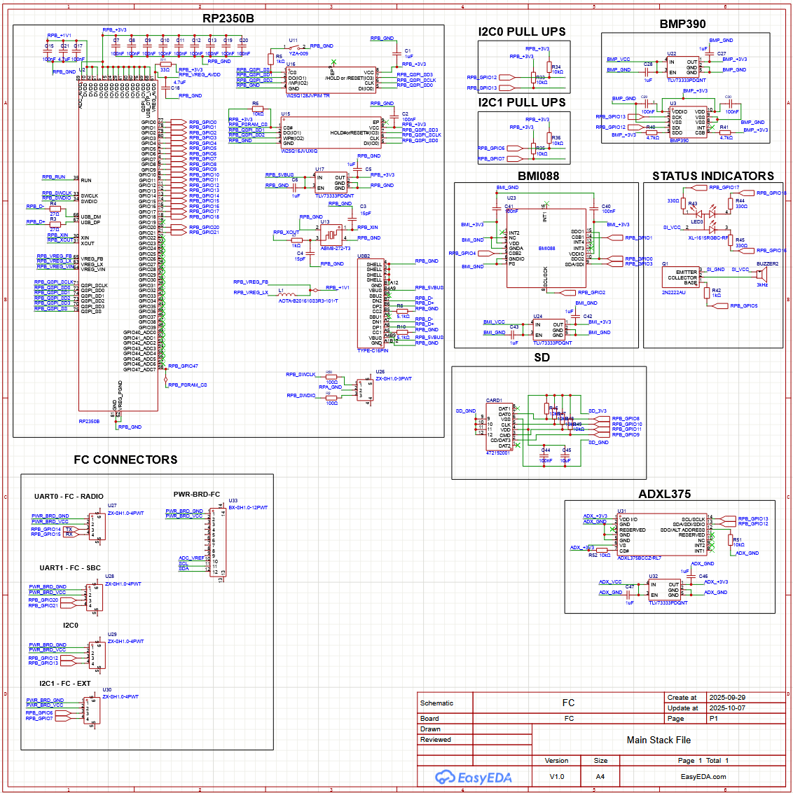
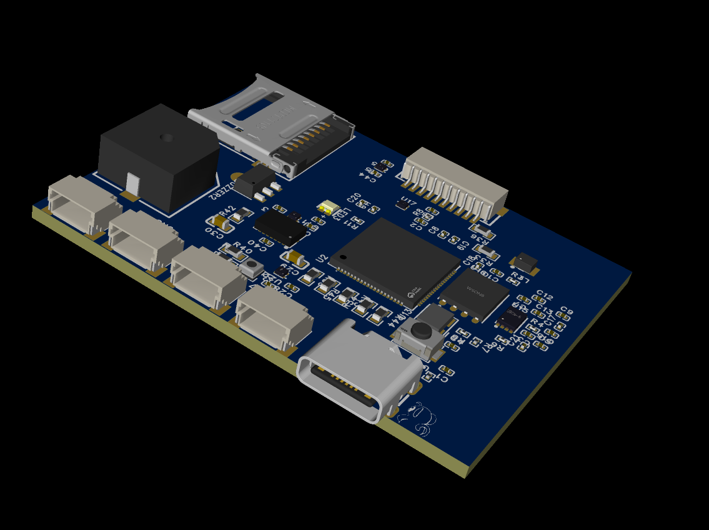

# Where we're at right now
During the first avionics meeting I assigned Jordan as the hardware lead and this proved to be the right choice. He is very knowledgeable and has the drive to push things forward. Unfortunately for us though, not many people have the knowledge or drive to help him out. Gabriel and Jordan (Senior project colleagues) had gradually been working on schematics for each of the components on MARV. To bring up develpment velocity, Jordan decided on referencing open source schematics wherever we could, then remove any unnecessary components. There was still some confusion about the pinout of the flight controller, so I hopped on to the PCB development.

# PCB design woes
Prior to this I had absolutely no experience in designing a PCB schematic, so it was pretty intimidating, but using EasyEDA helped out a great deal. It had almost all of the components we needed with the exception of the SX1262. Jordan found the footprint for the SX1262 waveshare variant we're using on some other open source project and we were able to adapt it in ours. The variants on JLC PCB were either too powerful and violated IREC guidelines or lacked the built in antenna connector on the ANT pin. I preferred the built in antenna connector just because I know RF traces are another can of worms I would rather not worry about right now. We focused on getting the schematic done for all the sensors/modules and between the three of us we pushed it out in one weekend.

 

I applied the pinout onto the schematic and did some more research on the sensors we had. After careful consideration, I decided on removing the ICM20948 from the extern and instead went with the ADXL375. My reasoning for this: 
- ADXL375 can withstand the G's of an L3 rocket so that we can still have good data during burnout
- ICM20948 was going to be on Extern, but Extern will be on a mast so that would have thrown off the Accel, Gyro, making any sensor fusion with this sensor useless
- ICM20948 magnetometer is completely outclassed by the BMM350 with its TMR tech. Sensor fusion benefits would be negligible.

After having another senior design meeting, we decided the flight controller was far enough along and we could start working on our individual parts. Gabriel focused on polishing the schematic, making sure similar components across the board were consolidated. Jordan, as the most knowledgable in electrical engineering took on designing the ESC for the drone and the servo controller and power supply for the rocket. Although I do plan on helping out with the pinouts I decided to dedicate all my focus to the biggest obstacle, the AHRS and GNC framework. I'll delve deeper into this topic on another blog, but before that here's a quick render of our PCB! (**We definitely did not just arrange things in a random order so it could look pretty**)

