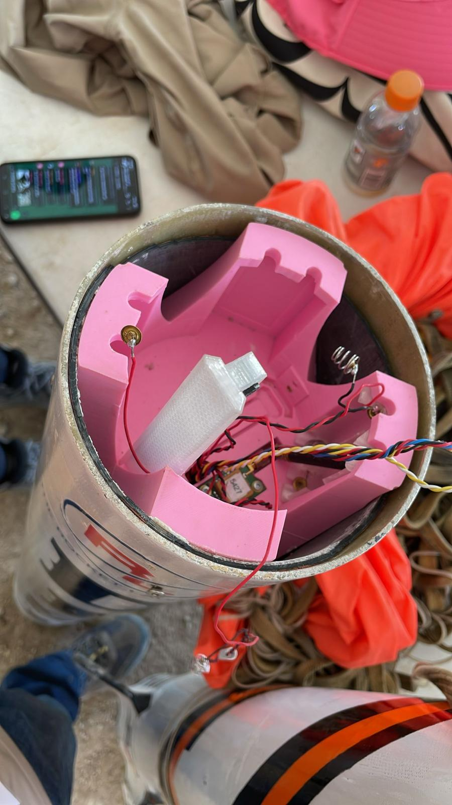
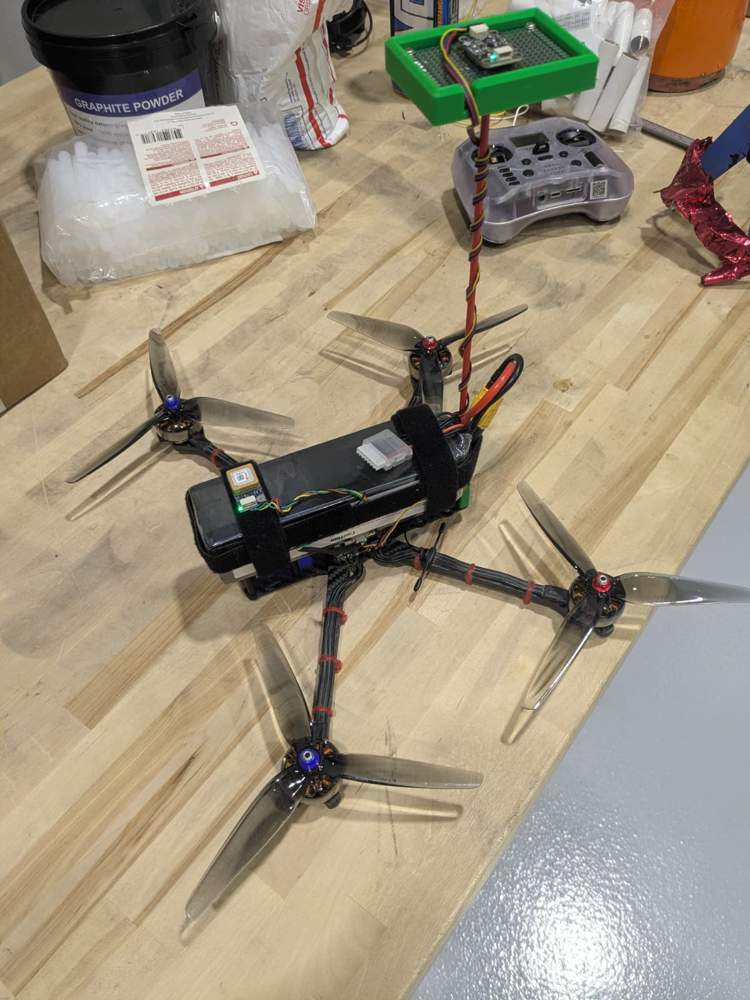
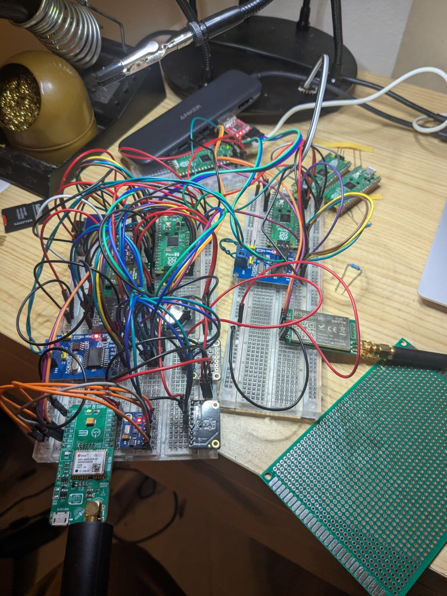
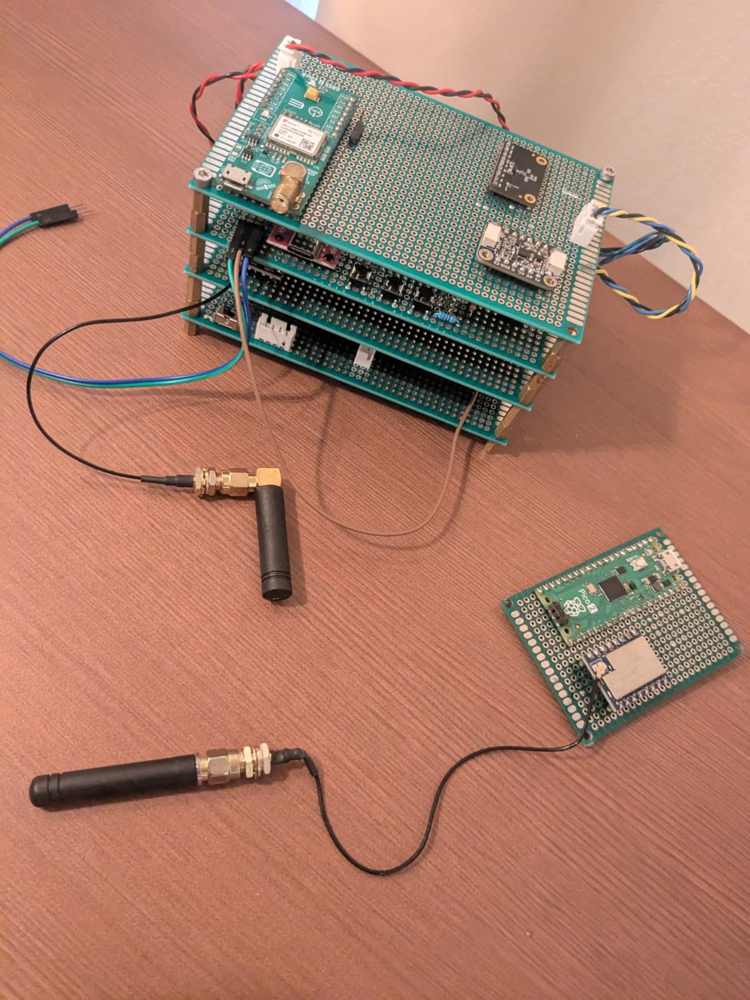

# Developing MARV: Advancing Rocket Avionics Beyond Brunito

Welcome to this documentation series on the development of MARV (Modular Avionics for Rockets and Vehicles), the next-generation flight computer designed to succeed Brunito at RL. As the newly appointed Avionics lead following the IREC competition, I am excited to share the journey of leveraging our collective experiences and resources to create a more robust and efficient system. This post outlines the foundational steps, lessons learned, and strategic decisions that shaped MARV's early development.

## Stepping Up After IREC: A New Chapter in Avionics Leadership

Following our participation in IREC, I assumed the role of Avionics lead to apply the insights gained from Brunito's deployment. Brunito, while functional, was developed under tight constraints, and my initial exposure to avionics highlighted numerous opportunities for enhancement. Our goal with MARV is to build upon these foundations, addressing shortcomings and incorporating advanced features for improved performance in high-stakes rocket environments.

## Key Insights from Brunito's IREC Flight

Brunito's performance at IREC provided valuable lessons that directly informed MARV's design. Among the primary takeaways were:

- Implement soldered storage solutions to ensure data integrity under stress.
- Maintain separation between avionics and payload systems for modular reliability.
- Secure batteries firmly to prevent dislodgement during flight.
- Conduct extensive vibration testing, environmental simulations, hardware-in-the-loop (HIL), and software-in-the-loop (SIL) evaluations.

The most significant challenges with Brunito involved data gaps during burnout and system shutdown post-drogue deployment. Upon review, these issues stemmed from the SD card disconnecting momentarily under high g-forces and batteries shifting due to pyrotechnic charges. These experiences underscored the need for resilient hardware configurations in MARV.

## Summer Exploration: Building a Custom Drone for Deeper Insights

During the summer, I constructed a personal drone project to deepen my understanding of flight computer programming, particularly in systems involving active control rather than passive telemetry. Drawing from my embedded programming and hardware expertise, I reverse-engineered drone firmwares and adapted their principles to Level 3 rocketry applications. This hands-on endeavor served as a cornerstone for MARV's architecture.

## Selecting Core Hardware: Why the RP2350?

The initial phase focused on identifying suitable hardware. While the STM32F4/H7 series were viable options, the RP2350 emerged as the preferred choice due to several compelling advantages:

- **Cost Efficiency**: As a student-led organization with limited funding, prioritizing affordability allows us to allocate resources across all subteams without compromise.
- **Dual-Core Architecture**: This enables parallel task execution, which is essential for real-time processes such as dynamic air braking and roll control—insights gleaned from Brunito's development and open-source flight controller analyses.
- **Simplicity**: The RP2350B offers precisely the required SPI, UART, and I2C interfaces for our sensor suite, avoiding unnecessary complexity that could lead to feature creep and distract from core objectives.

By emphasizing these factors, we ensure MARV remains focused, reliable, and scalable.

## Curating the Sensor Suite

With the microcontroller selected, attention turned to the supporting sensors, chosen for compatibility and performance:

- **Primary IMU**: BMI088 (SPI) for high-precision inertial measurements.
- **Storage**: Soldered SD card (SPI) to eliminate disconnection risks.
- **Secondary IMU**: ICM20948 (I2C) for redundancy.
- **Barometric Pressure Sensor**: BMP390 (I2C) for altitude tracking.
- **Magnetometer**: BMM350 (I2C) for orientation data.
- **GPS Module**: Ublox NEO M9N for positioning.

This selection balances functionality with minimalism, optimizing for our operational needs.

## Modularizing Wireless Communication

To streamline the main flight controller's firmware, wireless transceiving was delegated to a dedicated microcontroller. This approach reduces complexity, preserves critical SPI bus integrity for essential sensors, and aligns with established practices in DIY drone ecosystems, where LoRa modules connect via UART to specialized firmware like ELRS.

The radio module hardware includes:

- **Long-Range Communication**: LoRa SX1262 (SPI).
- **Microcontroller**: RP2350A.
- **Interface**: UART connection to the primary flight controller.

The ground station mirrors this setup but incorporates a high-gain antenna for enhanced range.

## Choosing Development Tools: Elevating with Rust

Selecting the programming environment was a deliberate process, informed by Brunito's limitations. Seeking greater control while mitigating risks—especially in a collaborative team setting—I opted for Rust to minimize memory management errors without sacrificing precision. Complementary tools include:

- **rp-hal**: For hardware abstraction.
- **RTIC**: For real-time interrupt-driven concurrency.
- **defmt**: For efficient logging.
- **pico-probe**: For debugging support.

This toolchain empowers our team to develop sophisticated firmware safely and effectively.

## Prototyping Journey: From Breadboard to Refined Design

The summer was dedicated to driver development for all sensors, initially tested on a breadboard to validate communications and functionality.

Transitioning to a more permanent prototype involved rigorous evaluation of components, with selections refined for PCB manufacturability and cost constraints.

This iterative process has positioned MARV as a promising successor, ready for further testing and integration. Stay tuned for updates on firmware advancements, testing protocols, and integration milestones in upcoming posts. Your thoughts and questions are welcome!